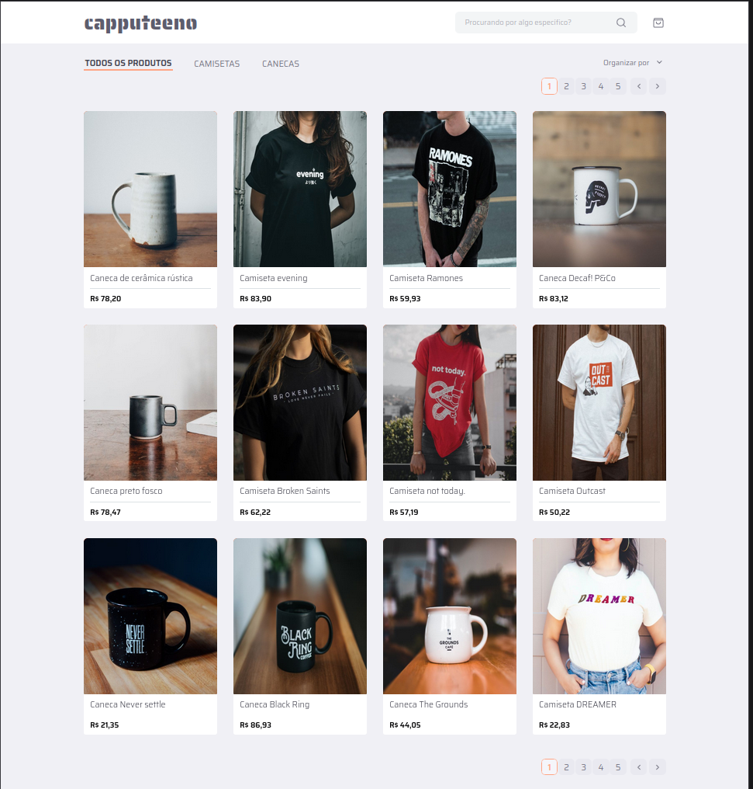

## Capputeeno - Challenge Frontend
Bem-vindo(a)! Este é um repositório que contém a minha solução para o [desafio frontend](https://github.com/Rocketseat/frontend-challenge) proposto pela [Rocketseat](https://github.com/Rocketseat).



## 🧠 Sobre
O objetivo deste projeto foi aperfeiçoar e treinar minhas habilidades em Frontend com Typescript e Next.js, com o suporte dos vídeos da [Fernanda Kipper](https://github.com/Fernanda-Kipper):
 - [Vídeo parte 1](https://youtu.be/fF-UWgeiELc)
 - [Vídeo parte 2](https://youtu.be/I_thj22FsrE)
 - [Repositório](https://github.com/Fernanda-Kipper/challenge-frontend/)

O desafio foi implementar um e-commerce para venda de canecas e camisetas com as seguintes funcionalidades:
 - [x] Catálogo de produtos com paginação
 - [x] Filtragem produtos por categoria
 - [x] Busca por nome do produto
 - [x] Adicionar e remover produtos do carrinho
 - [x] Finalizar compra

Para acessar o projeto online é só [clicar aqui!](https://capputeeno.lalunainsky.com/)

## 📋 Requerimento do Desafio
 - Siga o [protótipo](https://github.com/Rocketseat/frontend-challenge)
 - Usar o Next.js e o Typescript
 - Criar componentes com o styled-components
 - Consumir a API GraphQL fornecida

## 🖥️ Instalação
1. Clone este repositório
```bash
git clone https://github.com/lalunainsky/capputeeno-challenge-frontend.git
```

2. Vá até a pasta do projeto
```bash
cd capputeeno-challenge-frontend
```

### Frontend
3. Entre na pasta do Frontend
```bash
cd capputeeno
```

4. Instale as dependências
```bash
npm install
```

5. Rode o Frontend
```bash
npm run dev
```

### Rodar a API Fornecida
3. Entre na pasta da API
```bash
cd api
```

4. Instale as dependências
```bash
npm install
```

5. Rode a API
```bash
npm start
```